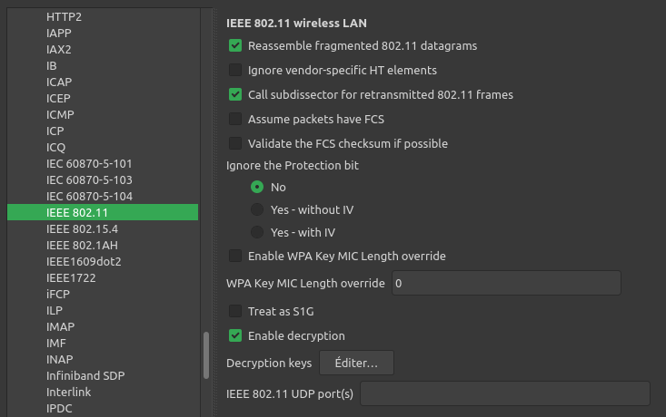
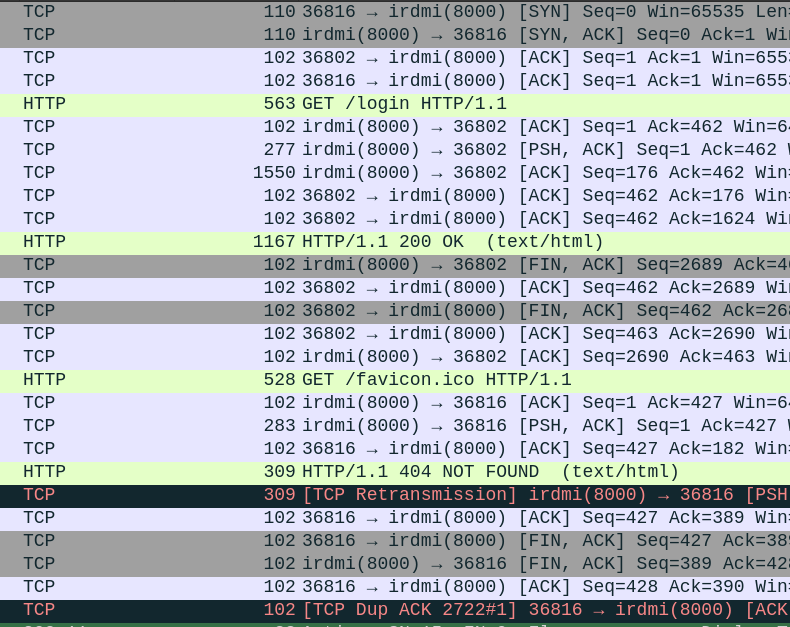
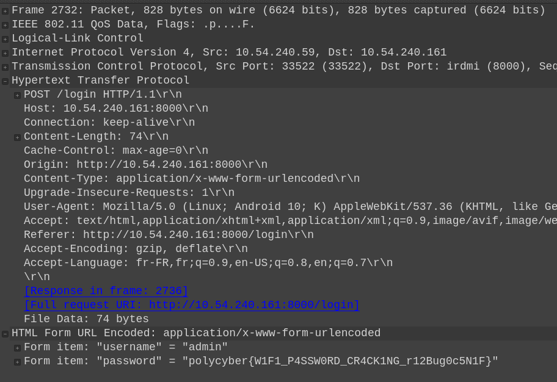

# Wireless Whispers

## Write-up FR

### Analyse initiale du PCAP dans Wireshark

On commence par ouvrir `wifi_capture.pcap` dans Wireshark.

On observe :

* Des trames 802.11
* Une séquence de Deauthentication frames
* Puis un 4-Way Handshake

Les trames de désauthentification (Deauth) sont envoyées par un attaquant pour forcer un client à se déconnecter du point d'accès WiFi.
Cela a pour but de forcer sa ré-authentification au point d'accès en effectuant un 4-way handshake.

#### Le 4-Way Handshake (WPA2)

Le 4-way handshake est le mécanisme utilisé par WPA/WPA2-PSK pour :

* Vérifier que le client connaît le mot de passe
* Dériver les clés de chiffrement de session
* Établir une communication chiffrée

Il s'agit d'un échange en **4 messages EAPOL** entre le client et le point d'accès.

Le mot de passe n'est jamais transmis en clair, mais le handshake contient suffisamment d'informations pour permettre une attaque par dictionnaire hors ligne.


### Extraction du hash WiFi

On utilise ensuite `hcxpcapngtool` de la suite [hcxtools](https://github.com/ZerBea/hcxtools), pour extraire les informations nécessaires de la capture :

```bash
./hcxpcapngtool -o hash.txt wifi_capture.pcap
```

Cette commande génère un hash au format compatible avec hashcat (mode 22000) à partir du 4-way handshake de la capture.


### Attaque par dictionnaire avec Hashcat

On lance ensuite une attaque par dictionnaire avec [hashcat](https://hashcat.net/hashcat/) et le dictionnaire de mots de passe fourni (*[rockyou.txt](https://github.com/danielmiessler/SecLists/blob/master/Passwords/Leaked-Databases/rockyou.txt.tar.gz)*) :

```bash
hashcat -m 22000 -a 0 hash.txt rockyou.txt
```

* `-m 22000` : format WPA-PBKDF2-PMKID+EAPOL
* `-a 0` : attaque par dictionnaire
* `hash.txt` : hash extrait précédemment
* `rockyou.txt` : dictionnaire de mots de passe fourni

Au bout de quelques minutes, on obtient le mot de passe Wifi !

```
i6love10science9
```

### Déchiffrement du trafic dans Wireshark

Une fois le mot de passe WiFi obtenu, on peut déchiffrer le trafic.

#### Étapes dans Wireshark :

1. Aller dans
   `Edit -> Preferences -> Protocols -> IEEE 802.11`

2. Activer `Enable decryption`



3. Dans `Decryption Keys`, ajouter le mot de passe qu'on a trouvé plus tôt :

```
wpa-pwd:i6love10science9
```


Une fois ces préférences appliquées, on peut voir du trafic HTTP à la fin de la capture.



Et en regardant le contenu de plus près, on peut voir une authentification sur un formulaire avec un mot de passe intéressant !




---

## Write-up EN


### Initial analysis of the PCAP in Wireshark

We begin by opening `wifi_capture.pcap` in Wireshark.

We observe:

* 802.11 frames
* A sequence of deauthentication frames
* Then a 4-way handshake

Deauthentication (Deauth) frames are sent by an attacker to force a client to disconnect from the WiFi access point.
The purpose of this is to force the client to re-authenticate to the access point by performing a 4-way handshake.

#### The 4-Way Handshake (WPA2)

The 4-Way Handshake is the mechanism used by WPA/WPA2-PSK to:

* Verify that the client knows the password
* Derive session encryption keys
* Establish encrypted communication

This involves an exchange of **4 EAPOL messages** between the client and the access point.

The password is never transmitted in clear text, but the handshake contains enough information to enable an offline dictionary attack.


### Extracting the WiFi hash

We then use `hcxpcapngtool` from the [hcxtools](https://github.com/ZerBea/hcxtools) suite to extract the necessary information from the capture:

```bash
./hcxpcapngtool -o hash.txt wifi_capture.pcap
```

This command generates a hash in a format compatible with hashcat (mode 22000) from the 4-way handshake in the capture.


Dictionary attack with Hashcat

We then launch a dictionary attack with [hashcat](https://hashcat.net/hashcat/) and the password dictionary provided (*[rockyou.txt](https://github.com/danielmiessler/SecLists/blob/master/Passwords/Leaked-Databases/rockyou.txt.tar.gz)*) :

```bash
hashcat -m 22000 -a 0 hash.txt rockyou.txt
```

* `-m 22000`: WPA-PBKDF2-PMKID+EAPOL format
* `-a 0`: dictionary attack
* `hash.txt`: previously extracted hash
* `rockyou.txt`: provided password dictionary

After a few minutes, we obtain the WiFi password!

```
i6love10science9
```

### Decrypting traffic in Wireshark

Once we have the WiFi password, we can decrypt the traffic.

#### Steps in Wireshark:

1. Go to
   `Edit -> Preferences -> Protocols -> IEEE 802.11`

2. Enable `Enable decryption`


3. In `Decryption Keys`, add the password found earlier:

```
wpa-pwd:i6love10science9
```


Once these preferences have been applied, we can see HTTP traffic at the end of the capture.


And looking more closely at the content, we can see authentication on a form with an interesting password!


## Flag

`polycyber{W1F1_P4SSW0RD_CR4CK1NG_r12Bug0c5N1F}`