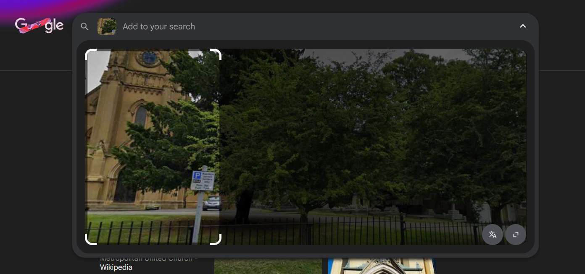
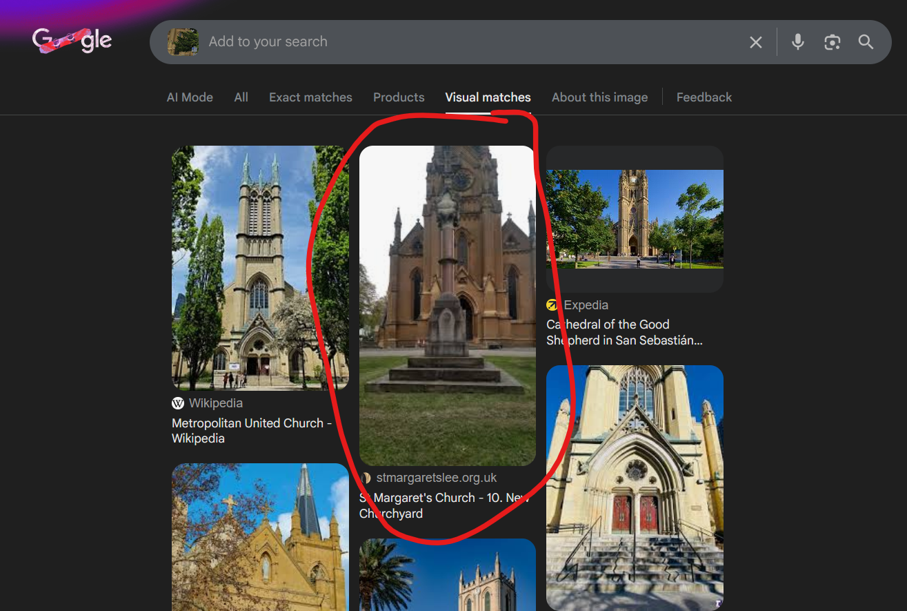
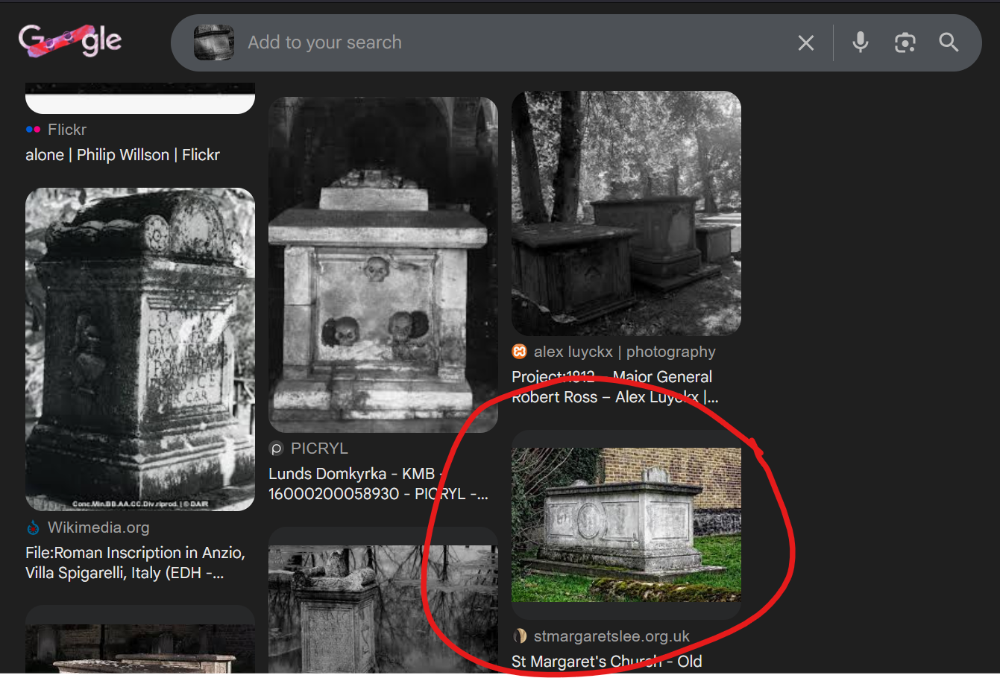

# La Fondatrice 3

## Write-up

### Français

**1) Retrouver la localisation**

Une bonne recherche par image avec Google Lens sur la première image (il fallait souvent rogner au bâtiment) menait à l'église St Margaret.

Ce n'était pas toujours le premier résltat, donc il fallait utiliser un peu de discernement ou comparer plusieurs possibilités.

Il était aussi possible d'arriver directement à la page de l'église avec Google Lens sur l'image de la tombe, mais ceci était intentionnellement plus difficile: ce n'était jamais le premier résultat à cause des effets de noir et blanc et de rotation que j'ai appliqués à l'image. :)

**2) Retrouver le papa**

Sur le site de l'église, ainsi que sur sa page wikipedia, il était mentionné qu'elle était connue pour abriter les tombes de plusieurs scientifiques dont Edmond Halley. En retrouvant la page sur le cimetière de l'église (https://www.stmargaretslee.org.uk/page/?title=Old+Church+Yard&pid=31), on arrivait à l'image exacte de la tombe (en couleurs), qui indique `The Tomb of Edmond Halley, Astronomer Royal`.

**3) Retrouver la fille**

La dernière étape était d'en déduire le nom de M.H., la fille de Edmond Halley. Le nom de famille était donc Halley, et le prénom se retrouvait sur pleins de pages biographiques de l'astronome Edmond, ou des pages d'arbres familiaux (ex. https://www.wikitree.com/wiki/Halley-148#Family).

On trouvait donc le nom complet: `Margaret Halley`.

### English

1) Finding the location

A thorough image search using Google Lens on the first image (often requiring cropping around the building) led to St. Margaret's Church.

This was not always the first result, so it was necessary to use some judgment or compare several possibilities.

It was also possible to go directly to the church's page with Google Lens on the image of the tomb, but this was intentionally more difficult: it was never the first result because of the black and white and rotation effects I applied to the image. :)

**2) Finding the father**

The church's website and Wikipedia page mentioned that it was known for housing the graves of several scientists, including Edmond Halley. By finding the page about the church's cemetery (https://www.stmargaretslee.org.uk/page/?title=Old+Church+Yard&pid=31), we come across the exact image of the tomb (in color), which reads `The Tomb of Edmond Halley, Astronomer Royal`

**3) Finding the daughter**

The last step was to deduce the name of M.H., Edmond Halley's daughter. The surname was Halley, and the first name could be found on many biographical pages about the astronomer Edmond, or on family tree pages (e.g., https://www.wikitree.com/wiki/Halley-148#Family).

And so we find the full name: `Margaret Halley`.

## Flag

`margarethalley` ou `MargaretHalley`
