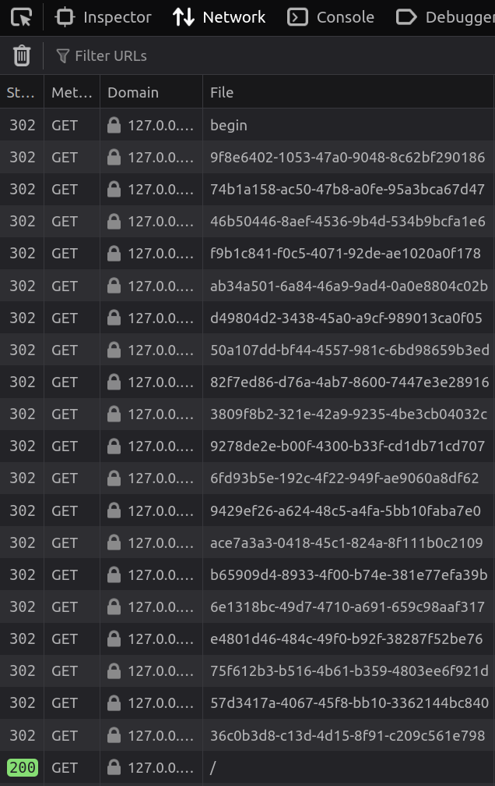
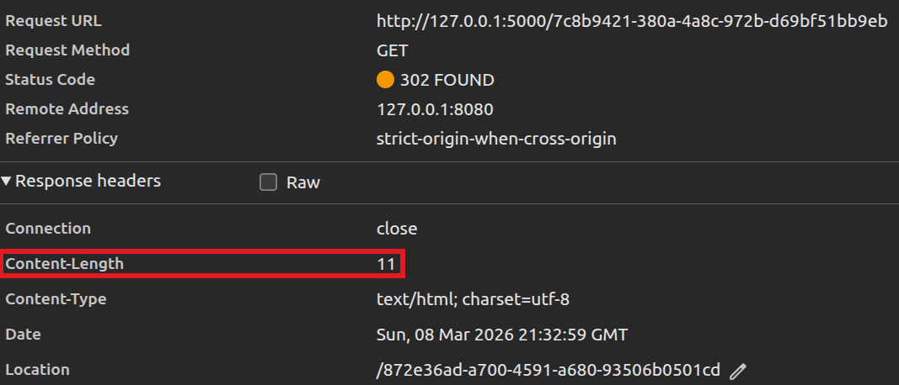
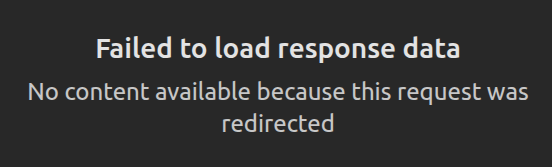

# Labo-rinthe

## Write-up - FR

La page d'accueil (`/`) est extrêment sommaire, un simple lien vers la page `/begin`.
Pourtant lorsque l'on clique dessus, on *reste* sur la page initiale.

Pour observer de plus prêt ce qu'il se passe, on peut ouvrir l'outil réseau du navigateur :



On peut voir de nombreuses redirections intermédiaires, avant d'être redirigé vers la page d'accueil. Ça vaut le coup de se pencher là dessus !

Dans les en-têtes on peut voir que ces réponses possèdent un corps mais malheureusement les navigateurs ne veulent pas nous le donner...





Qu'à cela ne tienne, on peut faire autrement !

Plusieurs chemins sont possibles :
- Un langage de programmation (Python, Bash, etc) pour avoir le contrôle sur chaque requête et sa réponse
- Un proxy HTTP comme Caido ou BurpSuite, pour inspecter le trafic entrant et sortant du navigateur
- Un outil de capture réseau comme Wireshark, pour analyser le trafic réseau transitant sur notre machine

On utilisera ici la 1ère solution, avec le langage Python.

On peut commencer par faire une requête (en utilisant la bibliothèque `requests`) à une des pages intermédiaires :

```python
import requests

response = requests.get("http://127.0.0.1:5000/37c020cb-64e2-470f-a384-e590c677490e")
print(response.status_code)
print(response.text)
```

Mauvaise pioche ! Notre script affiche un code de retour 200, c'est-à-dire la réponse finale après toutes les redirections. Pour voir les réponses intermédiaires, il faut qu'on utilise le paramètre `allow_redirects` et qu'on le mette à `False` :
```python
import requests

response = requests.get("http://127.0.0.1:5000/37c020cb-64e2-470f-a384-e590c677490e", allow_redirects=False)
print(response.status_code)
print(response.text)
```

```
302
{"11": "4"}
```

On a enfin le résultat d'une page intermédiaire ! En bouclant sur toutes les pages on obtient les JSON suivants :
```
{'13': '3'}
{'10': 'm'}
{'12': 'z'}
{'17': 'g'}
{'7': 't'}
{'9': '_'}
{'6': 'c'}
{'8': 's'}
{'2': 'd'}
{'4': 'r'}
{'11': '4'}
{'1': '3'}
{'16': 'u'}
{'3': '1'}
{'14': '-'}
{'0': 'r'}
{'5': '3'}
{'15': '9'}
```

On a très envie de remettre tout les nombres de gauche dans l'ordre :
```
{'0': 'r'}
{'1': '3'}
{'2': 'd'}
{'3': '1'}
{'4': 'r'}
{'5': '3'}
{'6': 'c'}
{'7': 't'}
{'8': 's'}
{'9': '_'}
{'10': 'm'}
{'11': '4'}
{'12': 'z'}
{'13': '3'}
{'14': '-'}
{'15': '9'}
{'16': 'u'}
{'17': 'g'}
```

On lit la chaîne de caractère suivante, qui a tout l'air du flag :
```
r3d1r3cts_m4z3-9ug
```

---

## Write-up - EN

The home page (`/`) is extremely basic, consisting of a simple link to the `/begin` page.
However, when you click on it, you *remain* on the initial page.

To take a closer look at what is happening, you can open the browser's network tool:


We can see numerous intermediate redirects before being redirected to the home page. It's worth looking into this!

In the headers, we can see that these responses have a body, but unfortunately browsers don't want to give it to us...


Never mind, there are other ways!

Several paths are possible:
- A programming language (Python, Bash, etc.) to control each request and its response
- An HTTP proxy such as Caido or BurpSuite, to inspect traffic entering and leaving the browser
- A network capture tool such as Wireshark, to analyze network traffic passing through our machine

Here we will use the first solution, with the Python language.

We can start by making a request (using the `requests` library) to one of the intermediate pages:

```python
import requests

response = requests.get("http://127.0.0.1:5000/37c020cb-64e2-470f-a384-e590c677490e")
print(response.status_code)
print(response.text)
```

Bad luck! Our script displays a return code of 200, which is the final response after all redirects. To see the intermediate responses, we need to use the `allow_redirects` parameter and set it to `False`:
```python
import requests

response = requests.get("http://127.0.0.1:5000/37c020cb-64e2-470f-a384-e590c677490e", allow_redirects=False)
print(response.status_code)
print(response.text)
```

```
302
{“11”: “4”}
```

We finally have the result of an intermediate page! By looping through all the pages, we get the following JSON:
```
{'13': '3'}
{'10': 'm'}
{'12': 'z'}
{'17': 'g'}
{'7': 't'}
{'9': '_'}
{'6': 'c'}
{'8': 's'}
{'2': 'd'}
{'4': 'r'}
{'11': '4'}
{'1': '3'}
{'16': 'u'}
{'3': '1'}
{'14': '-'}
{'0': 'r'}
{'5': '3'}
{'15': '9'}
```

We really want to put all the numbers on the left back in order:
```
{'0': 'r'}
{'1': '3'}
{'2': 'd'}
{'3': '1'}
{'4': 'r'}
{'5': '3'}
{'6': 'c'}
{'7': 't'}
{'8': 's'}
{'9': '_'}
{'10': 'm'}
{'11': '4'}
{'12': 'z'}
{'13': '3'}
{'14': '-'}
{'15': '9'}
{'16': 'u'}
{'17': 'g'}
```

We read the following character string, which looks like the flag:
```
r3d1r3cts_m4z3-9ug
```

---

## Flag

`r3d1r3cts_m4z3-9ug`
