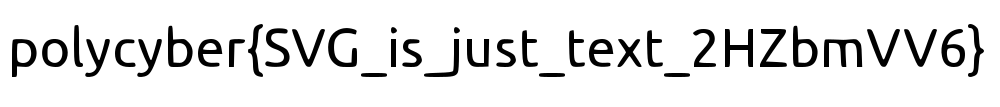

# Secret inVisible Gallery

## Write-up FR

En jettant un oeil au fichier SVG on peut voir que de nombreux rectangles blancs couvrant toute l'image sont appliqués de nombreuses fois:

```svg
<rect width="1000.000000pt" height="107.000000pt" x="0" y="0" fill="#FFFFFF" />
```

En les retirant tous (avec un script par exemple), on peut retrouver ce qui ce cache derrière !



## Write-up EN

By looking at the SVG file, we can see that numerous white rectangles covering the entire image are applied many times:

```svg
<rect width="1000.000000pt" height="107.000000pt" x="0" y="0" fill="#FFFFFF" />
```

By removing them all (with a script, for example), we can reveal what's hidden behind them!


## Flag

`polycyber{SVG_is_just_text_2HZbmVV6}`