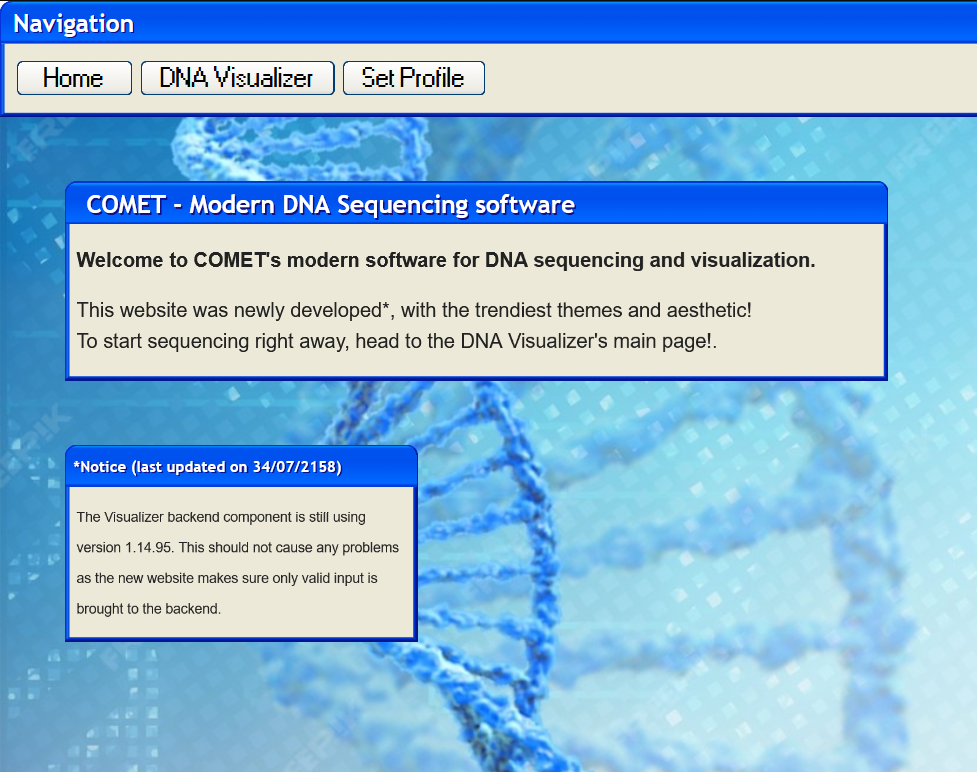
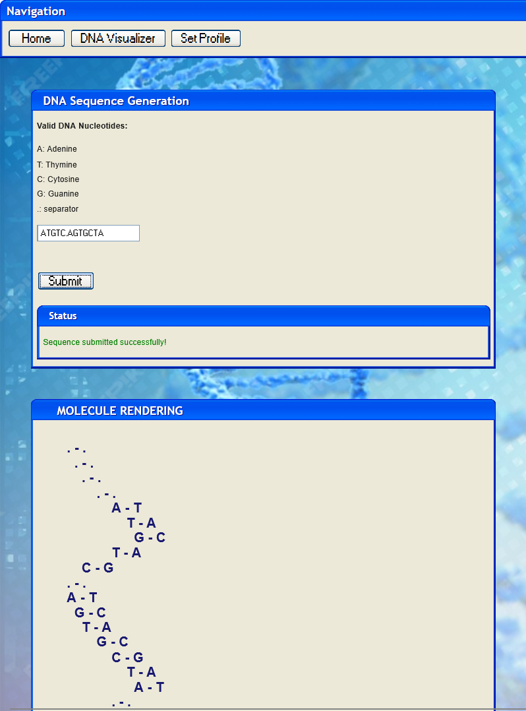
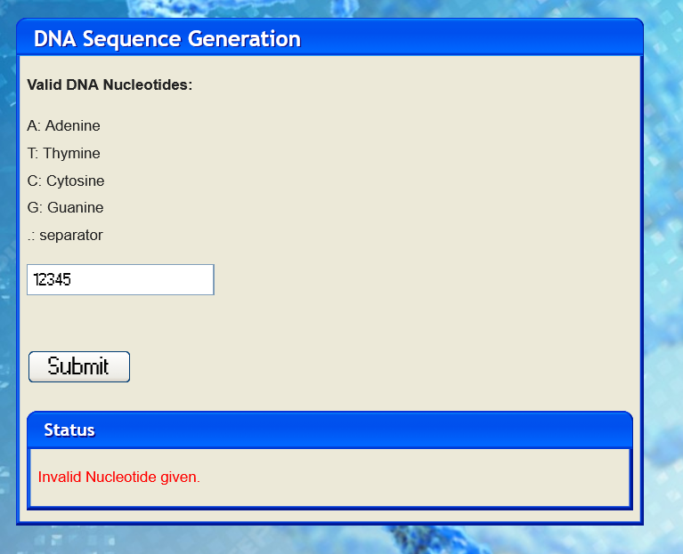
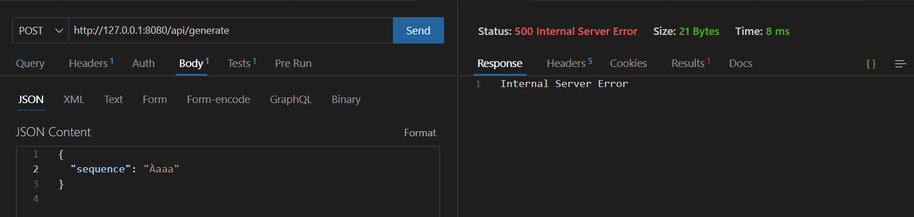
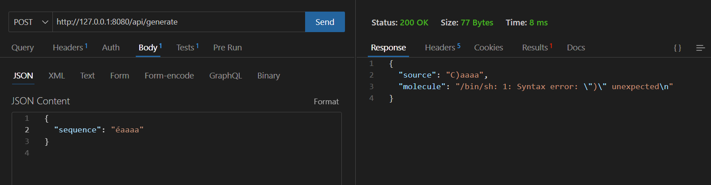
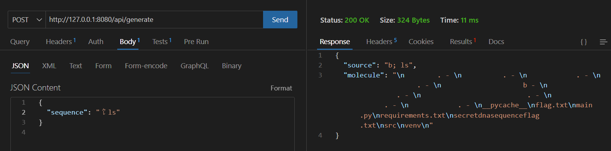
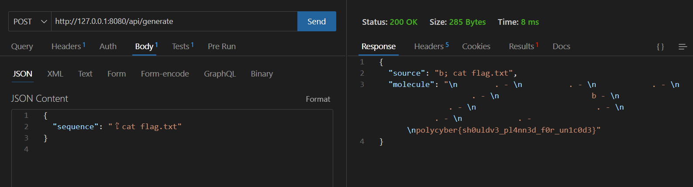

# DNA Visualizer 1

## Write-up

### Français

**1) Fonctionnement du site**


Ce défi commence avec une page Web présentant un outil de visualisation d'ADN, doté d'une interface ultra-moderne... les tendances sont cycliques après tout! 



La page d'accueil nous donne un premier indice sur le fait que le backend serait "vieux", et dépend du frontend pour filtrer les entrées valides.

La page DNA Visualizer ne semble pas fonctionner, et nous voyons dans la requête envoyée par HTTP au serveur que ce dernier nous retourne `{"detail":"No profile cookie set!"}`. 

Il faut donc commencer par la page "Set Profile" qui nous permettra de choisir des paramètres de "Profil ADN" pour ensuite utiliser la visualisation d'ADN.



**2) Contournement de la validation frontend**

Comme l'indiquait l'indice, nous pouvons voir dans le code source frontend qu'il y a un refus de tout caractère qui n'est pas dans `ACTG.`.



Cependant nous pouvons tout de même envoyer une requête au backend directement, avec des outils comme Burp Suite ou Thunder Client (extension de VSCode).

En investiguant (j'utilise Thunder Client), on remarque qu'il est possible d'envoyer n'importe quel caractère alphabétique, des points et des espaces. Les autres caractères spéciaux sont refusés... jusqu'à qu'on atteinde des caractères Unicode!

Le but de ce challenge était d'investiguer ce endpoint, pour voir que les caractères Unicode ne sont pas refusés. Au contraire, ils passent parfois la vérification du "vieux" backend et sont tronqués à de l'ASCII. En d'autres termes, chaque octet en représentation UTF-8 est interprété comme un caractère ASCII, et on perd le bit le plus significatif puisqu'ASCII est encodé sur 7 bits. 

Cela cause parfois des crash comme `À`:



Et pour les caractères qui sont tronqués en caractères ASCII valides comme `é`, la séquence est interprétée comme de l'ASCII et nous arrivons à injecter des caractères spéciaux interdits:



Ainsi les erreurs reçues nous permettent de déduire que le string est injecté dans une commande bash.

Pour savoir comment injecter un caractère, il faut utiliser des scripts qui affichent le binaire de caractères de texte, ou bien d'aller à un site comme https://design215.com/toolbox/utf8-3byte-characters.php qui permet de chercher des caractères Unicode en ordre.

Ainsi, en essayant d'injecter des caractères bash classiques comme `&`, `;`, `|`... nous pouvons injecter du code. 

Voici 2 exemples d'injections possibles:

- `æ`: interprété comme `C&`, ce qui permet de mettre la commande précédente en background et exécuter ce qu'on veut,
- `⻠`: interprété comme `b; `, ce qui exécute une commande suite à la fin de la précédente,
- Pour en trouver d'autres, regarder le binaire du caractère Unicode mais sans le bit le plus significatif.

Et voilà, nous avons de l'exécution de code, qui permettra de lister les fichiers et trouver le premier flag!


```json
POST /api/generate
{
  "sequence": "⻠ls"
}
```



```json
POST /api/generate
{
  "sequence": "⻠cat flag.txt"
}
```




### English


**1) How the site works**


This challenge begins with a web page featuring a DNA visualization tool with a state-of-the-art interface... trends are cyclical after all!


The home page gives us our first clue that the backend is “old” and relies on the frontend to filter valid entries.

The DNA Visualizer page does not seem to be working, and we can see in the HTTP request sent to the server that it returns `{"detail":"No profile cookie set!"}`.

We must therefore start with the “Set Profile” page, which will allow us to choose “DNA Profile” settings and then use the DNA visualization.


**2) Bypassing frontend validation**

As the hint indicated, we can see in the frontend source code that any character that is not in `ACTG.` is rejected.


However, we can still send a request directly to the backend using tools such as Burp Suite or Thunder Client (VSCode extension).

Upon investigation (I am using Thunder Client), we notice that it is possible to send any alphabetical character, periods, and spaces. Other special characters are rejected... until we reach Unicode characters!


The goal of this challenge was to investigate this endpoint to see that Unicode characters are not rejected. On the contrary, they sometimes pass the “old” backend verification and are truncated to ASCII. In other words, each byte in UTF-8 representation is interpreted as an ASCII character, and the most significant bit is lost since ASCII is encoded on 7 bits. 

This sometimes causes crashes such as `À`:


And for characters that are truncated to valid ASCII characters such as `é`, the sequence is interpreted as ASCII and we are able to inject prohibited special characters:


Thus, the errors received allow us to deduce that the string is injected into a bash command.

To find out how to inject a character, you need to use scripts that display the binary text characters, or go to a site such as https://design215.com/toolbox/utf8-3byte-characters.php, which allows you to search for Unicode characters in order.

Thus, by trying to inject classic bash characters such as `&`, `;`, `|`... we can inject code. 

Here are two examples of possible injections:

- `æ`: interpreted as `C&`, which allows us to put the previous command in the background and awaits another command,
- `⻠`: interpreted as `b; `, which awaits another command after the previous one has finished,
- To find others, look at the Unicode character binary, but without the most significant bit.

And there you have it, we have code execution, which will allow us to list the files and find the first flag!


```json
POST /api/generate
{
  "sequence": "⻠ls"
}
```


```json
POST /api/generate
{
  "sequence": "⻠cat flag.txt"
}
```


## Flag

`polycyber{sh0uldv3_pl4nn3d_f0r_un1c0d3}`